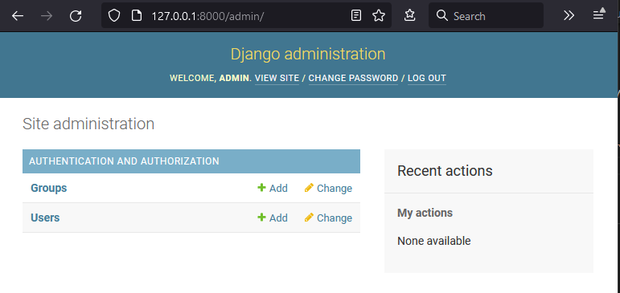
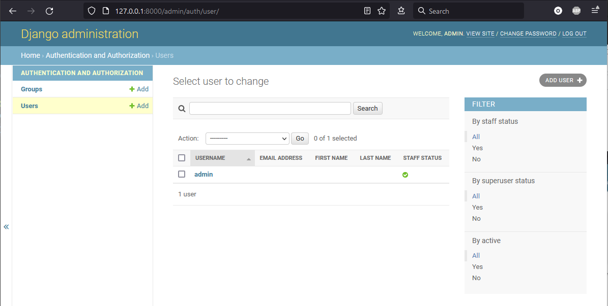
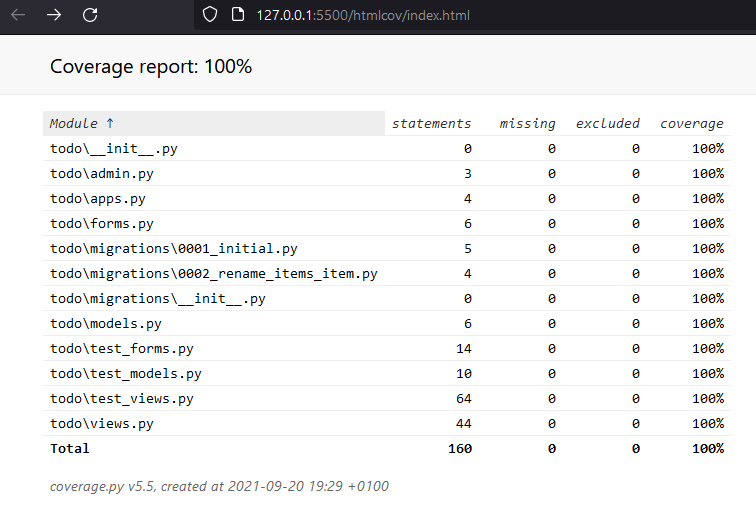
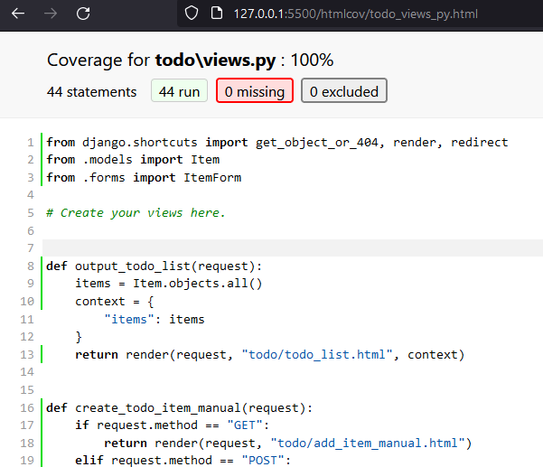

# ToDo
ToDo app written using Django framework

## Setup development environment on Windows and VSCode
1. install `Python` from Microsoft App Store
2. navigate to your projects folder
3. clone this repository
```bash
git clone https://github.com/ruszkipista/ci14-todo.git
```
4. navigate inside of the project folder
```bash
cd ci15-todo
```
5. create a python virtual environment
```bash
python -m venv venv
```
6. start VSCode with
```bash
code .
```
7. enter Ctrl+Shift+P in your VSCode and issue command **Python: select interpreter**, choose your virtual environment from the offered list
8. open a new terminal within VSCode
9. click in the top right part of the terminal window on the **v** sign (launch profile) and choose "Select Default Profile" - pick `Git Bash`
10. Launch a `Git Bash` terminal within VS Code
11. In the `Git Bash` terminal install `Django` into the virtual environment:
```bash
pip install django
```
12. create the Django project `django_todo`
```bash
django-admin startproject django_todo .
```
13. Validate the install by starting the webserver
```bash
python manage.py runserver
```
This is the expected page on http://127.0.0.1:8000/


14. create the Django app `todo`
```bash
python manage.py startapp todo
```

## Migrations
running the server (13.) gives this warning:
>You have 18 unapplied migration(s). Your project may not work properly until you apply the migrations for app(s): admin, auth, contenttypes, sessions.

*migrations* are django's way to convert python code into database operations. In the created project there are already such code which needs to be generated.

Run the following command to **test** run creating migrations based on latest code changes:
```bash
python manage.py makemigrations --dry-run
```
If no new migration needed to be created this is the output: `No changes detected`. Run without the `--dry-run` flag to actually create missing migrations.

The following command lists existing migrations:
```bash
python manage.py showmigrations
```
There are built in applications, which already have migrations. Here is an example output:
```bash
admin
 [ ] 0001_initial
 [ ] 0002_logentry_remove_auto_add
 [ ] 0003_logentry_add_action_flag_choices
auth
 [ ] 0001_initial
 [ ] 0002_alter_permission_name_max_length
 [ ] 0003_alter_user_email_max_length
 [ ] 0004_alter_user_username_opts
 [ ] 0005_alter_user_last_login_null
 [ ] 0006_require_contenttypes_0002
 [ ] 0007_alter_validators_add_error_messages
 [ ] 0008_alter_user_username_max_length
 [ ] 0009_alter_user_last_name_max_length
 [ ] 0010_alter_group_name_max_length
 [ ] 0011_update_proxy_permissions
 [ ] 0012_alter_user_first_name_max_length
contenttypes
 [ ] 0001_initial
 [ ] 0002_remove_content_type_name
sessions
 [ ] 0001_initial
todo
 (no migrations)
```

Run the following command to see how migrations will be applied:
```bash
python manage.py migrate --plan
```
Example output:
```
Planned operations:
contenttypes.0001_initial
    Create model ContentType
    Alter unique_together for contenttype (1 constraint(s))
auth.0001_initial
    Create model Permission
    Create model Group
    Create model User
admin.0001_initial
    Create model LogEntry
admin.0002_logentry_remove_auto_add
    Alter field action_time on logentry
admin.0003_logentry_add_action_flag_choices
    Alter field action_flag on logentry
contenttypes.0002_remove_content_type_name
    Change Meta options on contenttype
    Alter field name on contenttype
    Raw Python operation
    Remove field name from contenttype
auth.0002_alter_permission_name_max_length
    Alter field name on permission
auth.0003_alter_user_email_max_length
    Alter field email on user
auth.0004_alter_user_username_opts
    Alter field username on user
auth.0005_alter_user_last_login_null
    Alter field last_login on user
auth.0006_require_contenttypes_0002
auth.0007_alter_validators_add_error_messages
    Alter field username on user
auth.0008_alter_user_username_max_length
    Alter field username on user
auth.0009_alter_user_last_name_max_length
    Alter field last_name on user
auth.0010_alter_group_name_max_length
    Alter field name on group
auth.0011_update_proxy_permissions
    Raw Python operation ->     Update the content_type of prox…
auth.0012_alter_user_first_name_max_length
    Alter field first_name on user
sessions.0001_initial
    Create model Session
```
Run without the `--plan` flag to actually apply:
```
Operations to perform:
  Apply all migrations: admin, auth, contenttypes, sessions
Running migrations:
  Applying contenttypes.0001_initial... OK
  Applying auth.0001_initial... OK
  Applying admin.0001_initial... OK
  Applying admin.0002_logentry_remove_auto_add... OK
  Applying admin.0003_logentry_add_action_flag_choices... OK
  Applying contenttypes.0002_remove_content_type_name... OK
  Applying auth.0002_alter_permission_name_max_length... OK
  Applying auth.0003_alter_user_email_max_length... OK
  Applying auth.0004_alter_user_username_opts... OK
  Applying auth.0005_alter_user_last_login_null... OK
  Applying auth.0006_require_contenttypes_0002... OK
  Applying auth.0007_alter_validators_add_error_messages... OK
  Applying auth.0008_alter_user_username_max_length... OK
  Applying auth.0009_alter_user_last_name_max_length... OK
  Applying auth.0010_alter_group_name_max_length... OK
  Applying auth.0011_update_proxy_permissions... OK
  Applying auth.0012_alter_user_first_name_max_length... OK
  Applying sessions.0001_initial... OK
```

## Create the first user for administration purpose
```bash
python manage.py createsuperuser

Username: admin      
Email address: 
Password: 
Password (again):
The password is too similar to the username.
This password is too short. It must contain at least 8 characters.
This password is too common.
Bypass password validation and create user anyway? [y/N]: y
Superuser created successfully.
```
Run the server again with `python manage.py runserver` and login on http://127.0.0.1:8000/admin with the just created user/password.


click on `Users`:



## Testing
in `/todo/tests.py` create new class
```python
from django.test import TestCase
class TestDjango(TestCase):
    def test_my_case(self):
        self.assertEqual(1,0)
```
run test with `python manage.py test`, that produces the log of a failed test case:
```
System check identified no issues (0 silenced).
F
======================================================================
FAIL: test_my_case (todo.tests.TestDjango)
----------------------------------------------------------------------
Traceback (most recent call last):
  File "ci15-todo\todo\tests.py", line 4, in test_my_case
    self.assertEqual(1,0)
AssertionError: 1 != 0
----------------------------------------------------------------------
Ran 1 test in 0.005s
FAILED (failures=1)
```
You can rename the `tests.py` file to `test_<something>.py` and django will still find it and run at testing.

You can be more specific what you are testing
* `python manage.py test todo.test_forms` - only one test file
* `python manage.py test todo.test_forms.TestItemForm` - only one class from a test file
* `python manage.py test todo.test_forms.TestItemForm.test_fields_are_explicit_in_form_metaclass` - only one test method

Best practice to separate tests into `test_forms.py`, `test_views.py` and `test_models.py`.
Testing creates a temporary database which gets destroyed after tests run"

## Code Coverage in testing
install module `coverage`:
```bash
pip install coverage
```
run the code coverage detection with
```bash
coverage run --source=todo manage.py test
```
Check the coverage report:
```bash
$ coverage report
Name                                        Stmts   Miss  Cover
---------------------------------------------------------------
todo\__init__.py                                0      0   100%
todo\admin.py                                   3      0   100%
todo\apps.py                                    4      0   100%
todo\forms.py                                   6      0   100%
todo\migrations\0001_initial.py                 5      0   100%
todo\migrations\0002_rename_items_item.py       4      0   100%
todo\migrations\__init__.py                     0      0   100%
todo\models.py                                  6      0   100%
todo\test_forms.py                             14      0   100%
todo\test_models.py                            10      0   100%
todo\test_views.py                             64      0   100%
todo\views.py                                  44      0   100%
---------------------------------------------------------------
TOTAL                                         160      0   100%
```
wherever it is not 100%, consider writing test case(s) for them

generate HTML report from the coverage details:
```bash
coverage html
```
This creates a new `coverage` folder which contains a static website. Start the webserver (e.g. Live Server plugin in VS Code) on the `index.html` file.

