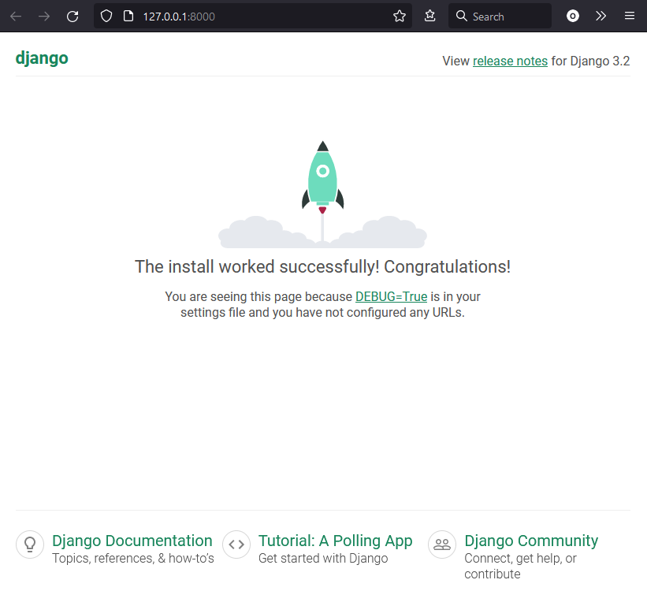

# ToDo
ToDo app written using Django framework

## Setup development environment on Windows and VSCode
1. install `Python` from Microsoft App Store
2. navigate to your projects folder
3. clone this repository
```bash
git clone https://github.com/ruszkipista/ci14-todo.git
```
4. navigate inside of the project folder
```bash
cd ci14-todo
```
5. create a python virtual environment
```bash
python -m venv venv
```
6. start VSCode with
```bash
code .
```
7. enter Ctrl+Shift+P in your VSCode and issue command **Python: select interpreter**, choose your virtual environment from the offered list
8. open a new terminal within VSCode
9. click in the top right part of the terminal window on the **v** sign (launch profile) and choose "Select Default Profile" - pick `Git Bash`
10. Launch a `Git Bash` terminal within VS Code
11. In the `Git Bash` terminal install `Django` into the virtual environment:
```bash
pip install django
```
12. create the Django project `django_todo`
```bash
django-admin startproject django_todo .
```
13. Validate the install by starting the webserver
```bash
python manage.py runserver
```
This is the expected page on http://127.0.0.1:8000/


14. create the Django app `todo`
```bash
python manage.py startapp todo
```

